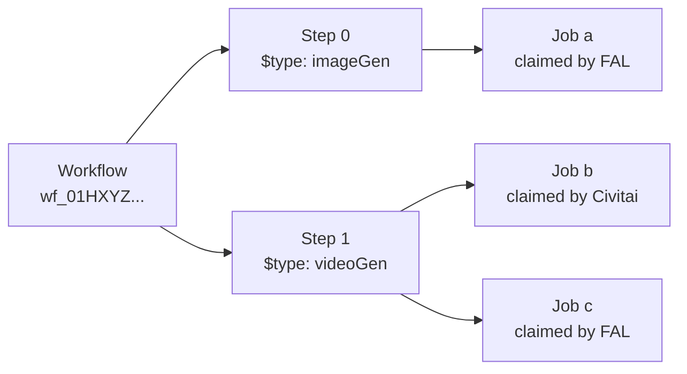

# Workflows

The orchestrator has three nested concepts. Most of what you do lives at the top two; the third is mostly useful for diagnostics.

* **Workflow** — what you submit. A container with metadata, tags, payment rules, and one or more steps. Identified by a `workflowId`.
* **Step** — a unit of work inside a workflow. Each step has a `$type` (the step type — `imageGen`, `videoGen`, `transcription`, …) and an `input`, and produces one or more outputs.
* **Job** — a unit of work the step needs done. A step may emit zero, one, or many jobs — that's up to the step. Providers race to claim each job (only compatible providers compete), and the winning provider executes it. You don't schedule jobs directly.

(*A **recipe** is a separate concept: a typed convenience endpoint at `/v2/consumer/recipes/{name}` that wraps a single-step workflow so callers who only need one step type can skip the polymorphic `$type`. See [Submitting Work → The per-recipe path](./submitting-work#the-per-recipe-path).*)



## Workflows

A workflow is what you `POST` to [`SubmitWorkflow`](/orchestration/reference/operations/SubmitWorkflow). It lives from submission until it hits a terminal status, after which it remains queryable via [`GetWorkflow`](/orchestration/reference/operations/GetWorkflow) for audit and result retrieval.

Key fields on a returned [`Workflow`](/orchestration/reference/operations/GetWorkflow):

| Field | What it tells you |
|-------|-------------------|
| `id` | Opaque workflow ID (prefixed `wf_`). Use everywhere you reference this workflow. |
| `status` | Current lifecycle state — see [Status lifecycle](#status-lifecycle). |
| `steps` | Array of [`WorkflowStep`](/orchestration/reference/operations/GetWorkflow) objects — the actual work and results. |
| `createdAt` / `startedAt` / `completedAt` | Timing. `startedAt` is null until the orchestrator begins execution; `completedAt` is null until terminal. |
| `cost` / `transactions` | What was charged, broken down by Buzz currency — see [Submitting Work → Payments](./submitting-work#payments-buzz). |
| `tags` | Indexed strings you can filter by via [`QueryWorkflows`](/orchestration/reference/operations/QueryWorkflows). |
| `metadata` | Arbitrary JSON you attached at submission (or via [`UpdateWorkflow`](/orchestration/reference/operations/UpdateWorkflow)). Not indexed. |
| `nsfwLevel` | Content classification, computed from step outputs. |
| `callbacks` | Registered webhooks — see [Results & webhooks](./results-and-webhooks). |

Submitted-only fields (`upgradeMode`, `allowMatureContent`, `currencies`, `experimental`, `arguments`) come back on the response as well so you can see what policy the workflow ran under.

## Steps

Each entry in `steps` is a [`WorkflowStep`](/orchestration/reference/operations/GetWorkflow). Steps are how you express *what* to do; the `$type` discriminator picks the step type and the `input` schema.

```json
{
  "$type": "videoGen",
  "name": "clip",
  "input": { "engine": "wan", "version": "v2.6", /* ... */ },
  "priority": "normal",
  "timeout": "00:10:00",
  "retries": 2
}
```

| Field | Purpose |
|-------|---------|
| `$type` | The step type. Switches which `input` schema applies. See the [API reference](/orchestration/reference/) for the full set (`imageGen`, `videoGen`, `imageUpscaler`, `transcription`, `textToSpeech`, `chatCompletion`, `comfy`, …). |
| `name` | Optional step name. Needed if another step wants to refer to this one. Defaults to the array index (`"0"`, `"1"`, …). |
| `input` | Payload specific to the step type — the bulk of a real request. |
| `priority` | Scheduling hint (`low`, `normal`, `high`). Higher priority jumps the queue, subject to your tier. |
| `timeout` | ISO 8601 duration — maximum time this step may run before the orchestrator marks it `expired`. |
| `retries` | Maximum retry count before declaring the step `failed`. Each retry may claim a different provider. |

On a fetched workflow, each step also carries:

| Field | What it tells you |
|-------|-------------------|
| `status` | Per-step status. A workflow's overall status rolls up from its steps. |
| `jobs` | The concrete jobs the orchestrator ran for this step. |
| `estimatedProgressRate` | `0.0`–`1.0` estimate of how far along the step is — see [How `estimatedProgressRate` is calculated](#how-estimatedprogressrate-is-calculated) below. Null if the step hasn't started. |
| `startedAt` / `completedAt` | Step-level timing. |
| `metadata` | Step-scoped metadata you attached. |

You can amend a step before it starts running via [`UpdateWorkflowStep`](/orchestration/reference/operations/UpdateWorkflowStep) / [`PatchWorkflowStep`](/orchestration/reference/operations/PatchWorkflowStep) — useful for fixing an `input` mistake while the workflow is still `unassigned`.

## Jobs

A job is a single unit of work the step needs done. A step decides how many jobs to emit — **zero, one, or many** — based on its inputs (e.g. a batch-of-4 image generation emits four jobs; a single ChatCompletion emits one; a validation-only step may emit zero). Each emitted job is published to the provider pool; compatible providers race to claim it, and the winner runs it.

Most consumer code can ignore the jobs array and just look at step-level status and output — but jobs are where you see *why* something failed, how long it queued, and which provider actually ran it.

| Field | Purpose |
|-------|---------|
| `id` | Internal job ID (for support / logs). |
| `status` | Same enum as workflow/step. |
| `queuePosition` | A job is queued with every compatible provider simultaneously; this field reports the position in **one** of those queues — the provider most likely to claim the job next. A different provider may still win the race. |
| `cost` | A relative **complexity** score for this job — like a query-planner cost, with no absolute unit. A cost of `4` is roughly twice as complex as a cost of `2`. This is *not* what you get charged: Buzz charges live on the workflow's `transactions` / `cost` ([Payments](./submitting-work#payments-buzz)). |
| `estimatedProgressRate` | `0.0`–`1.0` progress estimate — see [How `estimatedProgressRate` is calculated](#how-estimatedprogressrate-is-calculated). |
| `reason` / `blockedReason` | On failure, why — surfaced into step status as well. See [Errors & retries → Step-level failures](./errors-and-retries#step-level-failures). |

Multiple jobs on a step can come from two distinct sources:

* **Fan-out**: the step legitimately needs multiple units of work (e.g. a batch generating N images emits N jobs). All of them must succeed for the step to succeed.
* **Retries**: if `retries > 0` and a job fails transiently, the orchestrator emits a replacement job. The step succeeds as soon as the retry succeeds.

You can tell these apart by looking at the jobs' timing and `reason` — retry jobs appear after a failed sibling, fan-out jobs run in parallel from the start.

### How `estimatedProgressRate` is calculated

`estimatedProgressRate` is derived, not reported. The orchestrator combines two numbers:

* **Job cost** — the relative complexity score on the job (see above).
* **Worker throughput** — the recorded cost-per-second the worker has been completing on recent jobs.

Progress is `elapsed × throughput / cost`, clamped to `0.0`–`1.0`. It's useful for driving progress bars and ETAs, but treat it as a hint: cost estimation isn't perfect and real-world throughput varies by job shape, so actual completion can arrive earlier or later than the estimate suggests.

## Dependencies & parallelism

By default the orchestrator runs as much as it can at the same time:

* **Steps run concurrently** unless one depends on another.
* **Jobs run concurrently** within a step unless one depends on another.
* A step's jobs don't start until the step's dependencies have resolved. A step may even emit **more jobs asynchronously while it's still in progress** — `jobs` is not a fixed set you can count at the start.

### What creates a dependency

A dependency is created when one step *consumes the output of another*. Anywhere a step's `input` accepts a value, you can substitute a reference object instead:

```json
{
  "$ref": "<source name>",
  "path": "<dotted path into the source>"
}
```

The orchestrator resolves the reference at runtime and wires up the edge automatically.

```json
{
  "steps": [
    {
      "$type": "imageGen",
      "name": "hero",
      "input": { "prompt": "a cat astronaut", "width": 1024, "height": 1024 }
    },
    {
      "$type": "imageUpscaler",
      "name": "hero-4k",
      "input": {
        "image": { "$ref": "hero", "path": "output.images[0].url" },
        "numberOfRepeats": 1
      }
    }
  ]
}
```

`hero-4k` now depends on `hero`; it stays `unassigned` until `hero` reaches `succeeded`, then the `image` field is populated with the resolved URL. If `hero` fails, `hero-4k` is canceled.

**Source names** in `$ref`:

* A step's explicit `name` — e.g. `"hero"` above.
* The implicit positional name `"$0"`, `"$1"`, … if the step didn't set one (`$0` = first step, `$1` = second, …).
* `"$arguments"` to read from workflow-level arguments (see below).
* A loop variable inside `repeat`-style steps (e.g. `"frame"` if the loop is bound `as: "frame"`).

The exact `path` available depends on the source step's output schema — see each step type's reference page for the shape.

### Workflow arguments

The workflow-level `arguments` field lets you template values that steps reference. Define the shape once, submit many instances with different argument values:

```json
{
  "arguments": {
    "prompt": "a cat astronaut",
    "seed": 42
  },
  "steps": [
    {
      "$type": "imageGen",
      "input": {
        "prompt": { "$ref": "$arguments", "path": "prompt" },
        "seed":   { "$ref": "$arguments", "path": "seed" }
      }
    }
  ]
}
```

This is what makes saved workflows useful — your UI or SDK can ship a stable workflow template and only change `arguments` per submission.

## Deduplication & caching

The orchestrator tries not to charge you twice for the same work. Two mechanisms help, both with caveats.

### Workflow deduplication

Submitting a workflow whose steps and arguments exactly match one you already submitted typically gets **deduplicated** — you'll receive a reference to the existing workflow instead of a new one spinning up. Useful for idempotent retries on your side.

### Result caching

Step outputs are cached when the step's inputs are deterministic enough to replay. On submission, if the orchestrator can resolve a step's output purely from cache, it serves the cached result and **doesn't charge you Buzz for that step**.

Cache entries have a finite lifetime — typically around 30 days, but that's not guaranteed. An eviction between submissions means the second run pays full price.

### Caveats

Both mechanisms have **undocumented exceptions** — certain step types, parameter combinations, or account states bypass dedup / cache. Don't build correctness guarantees on top of them; treat them purely as a cost optimization. If you need exactly-once semantics, track your own `workflowId`s on your side.

## Status lifecycle

Workflows, steps, and jobs share the same [`WorkflowStatus`](/orchestration/reference/operations/GetWorkflow) enum:

```
unassigned → preparing → scheduled → processing ──▶ succeeded
                                             │
                                             ├──▶ failed
                                             ├──▶ expired
                                             └──▶ canceled
```

* `unassigned` — submitted, not yet routed to a provider
* `preparing` — assigned to a worker that is still downloading the required models/resources; work can't start until they're all local. While preparing, the step's `estimatedProgressRate` reflects download progress (0–1). Expect this state when a workflow uses models that aren't already cached on the fleet.
* `scheduled` — waiting in the queue of a worker that has all required resources ready
* `processing` — actively running; `estimatedProgressRate` now reflects generation progress
* `succeeded` / `failed` / `expired` / `canceled` — **terminal**; status will not change again

A workflow can move back and forth between `preparing` and `scheduled` (e.g. when it's reassigned to a different worker) — treat both as "queued, not started".

Terminal states are documented and webhook delivery enforces the invariant — see [Results & webhooks → Delivery semantics](./results-and-webhooks#delivery-semantics). Workflow status rolls up from step status: all steps succeeded → workflow succeeded; any step failed / expired / canceled → workflow does the same.

## When to look at each level

| Question | Where to look |
|----------|--------------|
| Did my request finish? What's the output? | Workflow `status` + `steps[].output` |
| Which step in a chain broke? | Per-step `status` + `reason` |
| Why did it fail for all providers? | Last job's `reason` / `blockedReason` |
| How much did it cost, split by currency? | Workflow `cost` + `transactions` |
| Was it SFW or mature? | Workflow `nsfwLevel` |

## Related

* [`SubmitWorkflow`](/orchestration/reference/operations/SubmitWorkflow) — create
* [`GetWorkflow`](/orchestration/reference/operations/GetWorkflow) — fetch
* [`QueryWorkflows`](/orchestration/reference/operations/QueryWorkflows) — list / filter
* [`UpdateWorkflow`](/orchestration/reference/operations/UpdateWorkflow) / [`PatchWorkflow`](/orchestration/reference/operations/PatchWorkflow) — amend
* [`DeleteWorkflow`](/orchestration/reference/operations/DeleteWorkflow) — cancel
* [Submitting Work](./submitting-work) — the body and query parameters you can pass at submission
* [Errors & retries](./errors-and-retries) — what step / job failures look like
