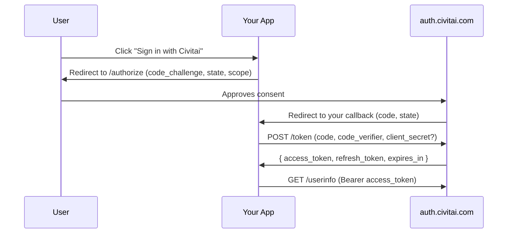

# OAuth

Civitai exposes an OAuth 2.0 server at `auth.civitai.com/api/auth/oauth/*`
(the legacy `civitai.com/api/auth/oauth/*` URLs still work, via a `308`
redirect — see [Endpoints](./endpoints)) so third-party apps can act on a
user's behalf — read their profile, manage their content, or spend their buzz
on AI generation — without ever seeing their password or a long-lived API key.

## OAuth or API keys?

| Use… | When |
|---|---|
| [API keys](../guide/authentication) | You're scripting **your own** account (CI jobs, personal automation, server-to-server with your own buzz). |
| **OAuth** | You're building an app that **other users sign into**. Each user grants your app a scoped, revocable token. |

OAuth tokens are scoped (users see exactly what your app is asking for), can
be capped for buzz spend, and can be revoked from civitai.com at any time —
without rotating anything on your side.

## Supported flow

Civitai implements **Authorization Code with PKCE** ([RFC 7636](https://datatracker.ietf.org/doc/html/rfc7636))
with refresh tokens. PKCE (S256) is mandatory for every client, public or
confidential — there's no "skip PKCE because we have a secret" path.



`client_credentials` is also supported for confidential clients that need
to act on **their own owner account** (no end-user involved) — useful for
server-side maintenance jobs.

## Endpoint roster

| Endpoint | Purpose |
|---|---|
| `GET/POST /api/auth/oauth/authorize` | Start the flow; user signs in and consents. |
| `POST /api/auth/oauth/token` | Exchange `code` for tokens, or refresh. |
| `POST /api/auth/oauth/revoke` | Invalidate an access or refresh token. |
| `GET /api/auth/oauth/userinfo` | Identify the user behind an access token. |

See [Endpoints](./endpoints) for the request/response shape of each.

## Tokens at a glance

* **Format** — opaque, prefixed `civitai_…`; SHA-256 hashed at rest.
* **Access token** — 1 hour TTL. Send as `Authorization: Bearer <token>`.
* **Refresh token** — 30 day TTL. Exchange for a new access token via `POST /token`
  with `grant_type=refresh_token`.
* **Authorization code** — 10 minute TTL. Single-use.

Treat tokens as bearer credentials: anyone with the string can act as the
user, within the granted scopes and budget.

## Next steps

* [Register an app](./register-app) — create a `client_id` from your Civitai account.
* [Quickstart](./quickstart) — run through the flow end-to-end with curl.
* [Scopes](./scopes) — pick the right permissions for what your app needs.
* [Buzz limits](./buzz-limits) — what to expect when users cap your app's spend.

::: info Reference implementation
**[civitai/civitai-oauth-demo](https://github.com/civitai/civitai-oauth-demo)**
— minimal Node.js / Express integration covering authorize, exchange,
refresh, and revoke. Clone it, fill in your `client_id` / `client_secret`,
and run the full flow against your account in a few minutes.
:::

::: tip Starter templates
**[civitai/civitai-app-starters](https://github.com/civitai/civitai-app-starters)**
— full app scaffolds plus the shared `@civitai/app-sdk` package (OAuth + PKCE,
encrypted-cookie sessions, scope and orchestrator helpers). Every starter ships
the same demo surface: log in with Civitai → show Buzz balance → preview
generation cost → submit one image → render the result.

* **[`next-app`](https://github.com/civitai/civitai-app-starters/tree/main/starters/next-app)** — Next.js 15 (App Router) + Tailwind. SSR/SEO-friendly. Best default.
* **[`sveltekit-app`](https://github.com/civitai/civitai-app-starters/tree/main/starters/sveltekit-app)** — SvelteKit 2 + Tailwind. Same surface as `next-app`.
* **[`react-pwa`](https://github.com/civitai/civitai-app-starters/tree/main/starters/react-pwa)** — Vite + React 19 with a tiny Hono BFF. SPA/PWA shape for tools and focused gen UIs.
* **[`svelte-pwa`](https://github.com/civitai/civitai-app-starters/tree/main/starters/svelte-pwa)** — Vite + Svelte 5 (no Kit) with a tiny Hono BFF. SPA/PWA shape.

Pull just the one you need:

```bash
npx tiged civitai/civitai-app-starters/starters/next-app my-app
cd my-app && cp .env.example .env && pnpm install && pnpm dev
```

Adding Sign-in-with-Civitai or swapping your image-gen provider into an
existing app? See [`PORTING.md`](https://github.com/civitai/civitai-app-starters/blob/main/PORTING.md).
:::
