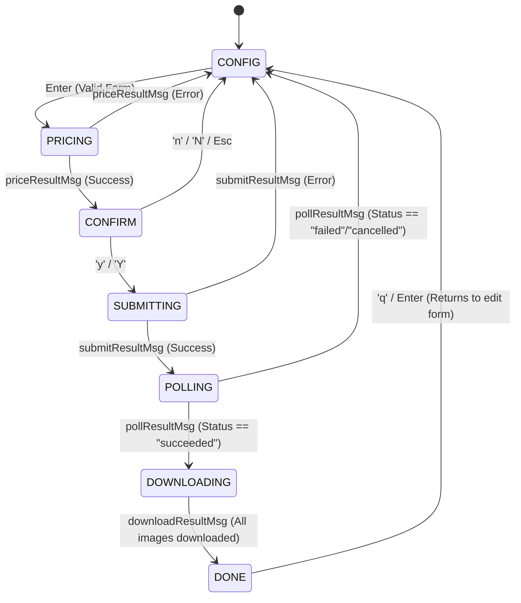

# TUI State Machine Specification

This document details the state-transition architecture for the `civitui` Bubble Tea application.

## 1. Phase Definitions and State Diagram

---

## 2. State-by-State Details

### I. CONFIG Phase
* **Purpose**: Collect parameters from the user.
* **Input Fields**:
  1. **Prompt** (string, required)
  2. **Negative Prompt** (string, optional)
  3. **Model AIR** (string, default: `air:flux1:checkpoint:civitai:618692@691639`)
  4. **Width** (int, default: 1024)
  5. **Height** (int, default: 1024)
  6. **Steps** (int, default: 20)
  7. **CFG Scale** (float, default: 7.0)
  8. **Quantity** (int, default: 1)
  9. **Seed** (int64/nil, default: nil)
* **Keyboard Triggers**:
  * `tab` / `down`: Shift focus to next field.
  * `shift+tab` / `up`: Shift focus to previous field.
  * `enter`: If prompt is not empty, transitions to `PRICING` and triggers `priceCmd`.
  * `ctrl+c` / `esc`: Quit the application.

---

### II. PRICING Phase
* **Purpose**: Submit a pricing calculation request (whatif check) to prevent spending Buzz unknowingly.
* **TUI View**: Display a progress spinner and message "Calculating price...".
* **Triggered Command**: `priceCmd(client, req)`
* **Transitions**:
  * On `priceResultMsg` (success): Update `m.cost = msg.cost`, transition to `CONFIRM`.
  * On `priceResultMsg` (error): Update `m.errMsg = msg.err`, transition to `CONFIG`.

---

### III. CONFIRM Phase
* **Purpose**: Show the user the Buzz cost and request execution authorization.
* **TUI View**: Display estimated cost and confirmation prompt: `This generation will cost X Buzz. Confirm? (y/n)`.
* **Keyboard Triggers**:
  * `y` / `Y`: Transition to `SUBMITTING` and trigger `submitCmd`.
  * `n` / `N` / `esc`: Transition to `CONFIG` (remembers form values).

---

### IV. SUBMITTING Phase
* **Purpose**: Dispatch the generation workflow to the CivitAI orchestrator.
* **TUI View**: Display progress spinner and message "Submitting job...".
* **Triggered Command**: `submitCmd(client, req)`
* **Transitions**:
  * On `submitResultMsg` (success): Set `m.jobID = msg.jobID`, transition to `POLLING`, and immediately trigger `pollCmd`.
  * On `submitResultMsg` (error): Set `m.errMsg = msg.err`, transition to `CONFIG`.

---

### V. POLLING Phase
* **Purpose**: Wait for the remote compute jobs to finish.
* **TUI View**: Display progress spinner, active job ID, and elapsed poll iterations.
* **Triggered Command**: `pollCmd(client, jobID)` which schedules status checking.
* **Transitions**:
  * On `pollResultMsg` (status == "succeeded"): Transition to `DOWNLOADING`, trigger `downloadCmd`.
  * On `pollResultMsg` (status == "failed" / "cancelled"): Set `m.errMsg`, transition to `CONFIG`.
  * On `pollResultMsg` (status in progress): Wait $N$ seconds, trigger `pollCmd` again.

---

### VI. DOWNLOADING Phase
* **Purpose**: Download completed image files to the local output directory.
* **TUI View**: Show spinner and progress: `Downloading images... (X/Y completed)`.
* **Triggered Command**: `downloadCmd(client, response)` (downloads each image asynchronously).
* **Transitions**:
  * On `downloadResultMsg`: Increment finished count. If finished == expected, transition to `DONE`.

---

### VII. DONE Phase
* **Purpose**: Present completed images to the user.
* **TUI View**: Split viewport. Left pane displays parameters, right pane displays the downloaded image list or Progressive Graphics Canvas (`timg` preview).
* **Keyboard Triggers**:
  * `q` / `esc` / `enter`: Transition back to `CONFIG` to allow editing parameters.
